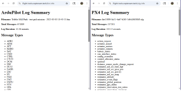
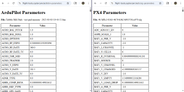
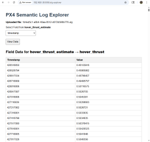

## ✈️ Flight-Tools: Modular UAV Log Analysis Suite

**Flight-Tools** is a set of python scripts that report data from ArduPilot (`.bin`) and PX4 (`.ulg`) log files. The benefit of these scripts is speed and convenience.  Other tools can report the same log file data.  Each Flight-Tool script is single purpose - so they avoid the setup and configuration of other tools.

### 🔍 Features

- Support for two ways to setup a python environment:
  - `requirements.txt` for pip-based environment setup
  - `pyproject.toml` compatible for UV environment setup

- Log file information reports
  - Scripts that report the message types contained in PX4 and ArduPilot log files [](images/log_info_example.png)

  - Stripts that report on the parameters and their associated values in PX4 and ArduPilot log files [](images/parameters_example.png)

  - A script to explore PX4 log files by user selection of message type, and field name under that message type - reporting on all values for that selection by timestamp. [](images/px4_semantic_log_explorer.png)

- Support for headless and GUI script execution

- Support for FLASK and web

---

## 🚀 Live Demo

You can explore a live version of the flight-tools suite at:

🔗 [https://www.coptercam.tech/flight-tools](https://www.coptercam.tech/flight-tools)

This deployment is hosted on a secure production server running Python 3.13, Gunicorn, and Nginx. It reflects the latest GitHub-tracked version of the codebase and is updated regularly.

🛠️ Features available in the live demo:
- ArduPilot and PX4 log analysis
- Modular diagnostic overlays
- Upload interface for `.bin` and `.ulg` files
- Real-time feedback and error handling

📦 This is a reference implementation for contributors and collaborators. Feel free to explore the interface before diving into the code.

---

### 📁 Project Structure
```text
flight-tools/
├── app.py                  # Main Flask app
├── templates/              # HTML templates
├── tools/                  # Analysis modules
│   ├── bin_info.py
│   ├── bin_parameter_list.py
│   ├── bin_power_plot.py
├── static/                 # CSS and JS assets
├── requirements.txt        # Python dependencies
└── README.md
```

---

### 🚀 Getting Started

1. Clone the repository
```bash
git clone https://github.com/CopterCamTech/flight-tools.git
cd flight-tools
```

2. Create and activate a virtual environment
```bash
python -m venv venv
source venv/bin/activate
```

3. Install dependencies
```bash
pip install -r requirements.txt
```

4. Launch the app
```bash
python app.py
```

Then visit `http://localhost:5000` in your browser and upload a .bin or .ulg file to begin analysis.

---

### 👥 Contributing

- We welcome clean, modular contributions that align with the project’s goals:

- Add new analysis modules to 'tools/'

- Improve UI/UX in 'templates/'

- Refactor for clarity and reproducibility

The routing in 'app.py' maps uploaded '.bin' and '.ulg' logs to specific analysis functions. If you're adding a new tool, you'll likely need to:

- Define a new route in 'app.py'

- Connect it to your module in 'tools/'

- Update the UI in 'templates/' to expose the new functionality

Please fork the repo, make changes in a feature branch, and submit a pull request with a clear description.

---

### 📜 License

This project is licensed under the MIT License.
